<div align="center">

# KR-Move Planner  

### _Your Personal Relocation & Visa Dashboard for South Korea_  

---


---

### **A fullstack dashboard helping users plan their move to South Korea**  
AI-generated visa strategy, tasks, timeline, job applications tracker, and automated expat card — all in one place.

</div>

---

## 🌏 What is KR-Move Planner?

**KR-Move Planner** is a personal **relocation & visa planning dashboard** designed for people preparing to move to **South Korea** (E-7 visa track, work visas, or long-term stay).

It combines:

- AI-powered **visa / relocation strategy generation**  
- automatically generated **task list** based on user profile  
- a progress-based **timeline** for the full relocation  
- a **job applications tracker**  
- a final **“Expat Card”** when everything is completed  

The goal is to provide a **clear roadmap**, reduce uncertainty, and centralize everything someone needs when preparing an international relocation.

This is a **non-commercial**, **open-source**, **MIT-licensed** project built for learning, portfolio, and real-world use.

---

## 🧭 User Flow Overview

```mermaid
flowchart TD
    A[Public Landing Page] --> B[Request Access Form]
    B --> C[Admin Review]
    C -->|Approve| D[Account Created]
    D --> E[User Login]
    E --> F[Onboarding Profile Form]
    F --> G[AI Generates Strategy + Tasks]
    G --> H[Dashboard]
    H --> I[Job Applications Tracker]
    H --> J[Timeline & Progress]
    J --> K[All Tasks Done + Job Found]
    K --> L[Generated Expat Card 🎉]
```



## ✨ Features

### ✔ Available / Implemented

- **Access Request System**  
  Users must request access (pseudo, company, position, hiring intent) before creating an account.  
  This limits AI usage and prevents unwanted billing.

- **Admin Panel**  
  Admin can approve or reject access requests.  
  Approval automatically creates a user account and sends login instructions.

- **User Onboarding Profile**  
  At first login, users complete their relocation profile:  
  first name, age, nationality, salary (€), years of experience, degree, job role.

- **AI-Generated Relocation Strategy**  
  A personalized strategy is generated from the user profile (HTML/Markdown).  
  Stored in database and displayed on dashboard.

- **AI-Generated Task List (Checklist)**  
  The AI returns a structured JSON list (documents, job search, Korean, admin tasks).  
  Items are saved as tasks linked to the user.

- **Dashboard Layout**  
  Clean layout showing the strategy + a tasks sidebar.

---

### 🚧 In Progress

- **Task Progression System**  
  Status management: `TODO / IN_PROGRESS / DONE`.

- **Timeline Based on Progress**  
  Dynamic timeline showing the user’s relocation progress in %.

- **Job Applications Tracker**  
  CRUD for: company, position, contact, date, status, notes.

- **Expat Card Generation**  
  Auto-generation when tasks = 100% and user has been hired.

- **Admin User Management UI**  
  Approve, delete, reset passwords.

---

### 🚀 Planned

- **Multi-language Support (EN/KR)**  
  Internationalize all UI text and pages.

- **Budget Planner**  
  With optional AI-generated financial advice (safe, simple, non-legal).

- **Strategy Regeneration Limits**  
  Limit AI usage per user (e.g., 3 regenerations max).

- **Token Usage Logging & Monitoring**  
  To control billing and detect abuse.

- **Improved AI Prompts + JSON Schemas**  
  Better structure for tasks, deadlines, categories.

- **Export Strategy to PDF**  
  One-click export via backend.

- **Notifications / Reminders**  
  Email or in-app reminders for upcoming tasks.

- **Public “Wall of Expats”**  
  Showcase completed expat cards (opt-in).

---

## 🔧 Installation (Basic)

```bash
git clone https://github.com/LaurentGourouvin/KR-Move-Planner
cd KR-Move-Planner
npm install
npm run dev
```
Or with docker 
```bash
docker compose up --build
```
## 🗄️ Backend Architecture Overview

### Database Tables (Minimal)

```txt
users                   # Authenticated accounts
profiles                # Onboarding relocation profile
relocation_strategies   # AI-generated HTML/Markdown strategy
tasks                   # Checklist items generated by AI
job_applications        # Job tracking entries
prospects               # Access requests before account creation
```
### Core Backend Modules

- `/auth` – authentication & login  
- `/admin/prospects` – approve or reject access requests  
- `/profile` – user onboarding profile (age, nationality, salary, degree…)  
- `/ai/strategy` – AI relocation strategy generator  
- `/tasks` – CRUD for AI-generated checklist  
- `/applications` – job applications tracker endpoints  

---

## 🧠 AI Strategy Generation

The AI engine produces:

1. **Relocation Strategy** (HTML/Markdown)  
2. **Task List** (JSON structure)

### Input Sent to AI

- Age  
- Nationality  
- Annual salary (€)  
- Years of experience  
- Highest degree  
- Current job position  
- Free-text project description  

### AI Output

- Strategy (HTML/Markdown)  
- JSON list of tasks containing:
  - `title`  
  - `description`  
  - `category`  
  - `optional deadlines`

All HTML is sanitized before rendering.

> ⚠ **Disclaimer**  
> AI-generated guidance is not legal or immigration advice.  
> Users must verify all steps with official Korean immigration sources.

---

## 📊 Dashboard Overview

### 🧩 Strategy Panel  
Displays the AI-generated relocation strategy.

### ✔ Task List  
Checklist generated from the AI JSON:

- `TODO`  
- `IN_PROGRESS`  
- `DONE`

### 📈 Timeline Progress  
Progress bar formula:

```txt
progress = tasks_done / tasks_total * 100
```

### 💼 Job Applications Tracker

Track your job search progress with a simple built-in CRM:

- Company  
- Position  
- Contact (email / LinkedIn)  
- Application date  
- Status (Pending / Interview / Offer / Rejected / Hired)  
- Notes  

This helps users centralize all applications during the E-7 visa job search process.

---

### 🎉 Expat Card

Automatically generated when:

- All tasks are marked as **DONE**
- At least one job application is **HIRED**

The Expat Card displays:

- Pseudo  
- Position  
- Company  
- Days remaining before expatriation  
- A personalized **Congratulations** message  

Optionally shown on a public **Wall of Expats** (opt-in).

---

## 🛣️ Roadmap

### 🔐 Access & Accounts
- [x] Access request form (pseudo, company, hiring role)  
- [x] Admin approval → account creation  
- [ ] Password reset flow  
- [ ] Admin user management (edit/delete users)  

### 🧠 AI & Strategy
- [x] Strategy generator (HTML/Markdown)  
- [x] Tasks generator (JSON → checklist)  
- [ ] Regeneration limits per user  
- [ ] Token usage logging (cost monitoring)  
- [ ] Improved structured prompts & schemas  

### 🗂 Dashboard
- [x] Strategy panel  
- [x] Tasks sidebar  
- [ ] Progress timeline  
- [ ] Job applications tracker (full CRUD)  
- [ ] Expat card generator  

### 🧱 Infrastructure
- [x] Initial PostgreSQL schema  
- [ ] Input validation & error handling  
- [ ] Docker Compose environment  
- [ ] GitHub Actions CI/CD  
- [ ] Demo data seeding  

---

## 📦 Repository Structure (Proposed)

```txt
KR-Move-Planner/
│
├── README.md
├── LICENSE
│
├── backend/
│   ├── src/
│   │   ├── routes/
│   │   ├── controllers/
│   │   ├── services/
│   │   ├── models/
│   │   └── middlewares/
│   ├── prisma/ or migrations/
│   ├── tests/
│   └── package.json
│
├── frontend/
│   ├── app/ or src/pages/
│   ├── components/
│   ├── hooks/
│   ├── lib/
│   ├── styles/
│   └── package.json
│
└── docs/
    ├── ai-prompts/
    └── api/
```
## 💡 Vision

KR-Move Planner aims to be:

- a **real-world fullstack project**  
- a **clean architecture example** (frontend + API + DB + AI)  
- a **practical relocation dashboard** for future expatriates  
- a **serious portfolio piece** aligned with my goal of working in South Korea  
- an experiment in **cost-controlled AI integration**  
- a demonstration of **problem-solving, UX thinking, and product design**  

The project represents both **technical ambition** and my **personal E-7 visa journey** — building the exact tool I wish existed when preparing to relocate.

---

## ⚖️ License

This project is released under the **MIT License**.  
You may freely use, modify, and distribute it for any purpose.

See: `LICENSE`.

---

## 🧑‍💻 Author

[](https://www.linkedin.com/in/laurentgourouvin)  
**Laurent Gourouvin**  
Fullstack JavaScript & PHP Developer 2025  
KR-Move Planner 

---

## 🛠 Tech Stack

- **React / Next.js** – Dashboard UI  
- **Node.js or Symfony** – Backend REST API  
- **TypeScript** – Fullstack type-safety  
- **PostgreSQL** – Relational database  
- **Docker** – Dev environment & services orchestration  
